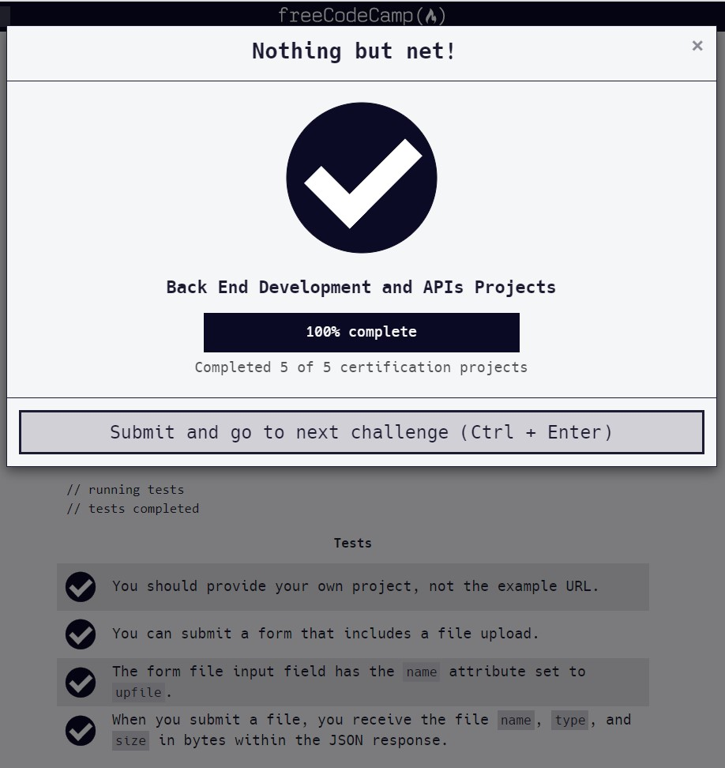

# File Metadata Microservice

#### Documentation can be found on : [https://github.com/viktoriussuwandi/File-Metadata-Microservice](https://github.com/viktoriussuwandi/File-Metadata-Microservice)

This is the result to complete the Metadata Microservice project. 
Instructions for building your project can be found at [https://www.freecodecamp.org/learn/apis-and-microservices/apis-and-microservices-projects/file-metadata-microservice](https://www.freecodecamp.org/learn/apis-and-microservices/apis-and-microservices-projects/file-metadata-microservice)

###  Some of additional features :
      * Avoid duplicate username
      * Avoid duplicate user_id using recursive function
      * Using local file to save user input
      * Using id generator to generate user id
      * Using express validator to validate user input

### Test Scenario :
- You should provide your own project, not the example URL.
- You can submit a `form` that includes a `file upload`.
- The form file input field has the `name` attribute set to `upfile`.
- When you submit a `file`, you receive the `file name`, `type`, and `size` in `bytes` within the `JSON` response.

### Test Result
